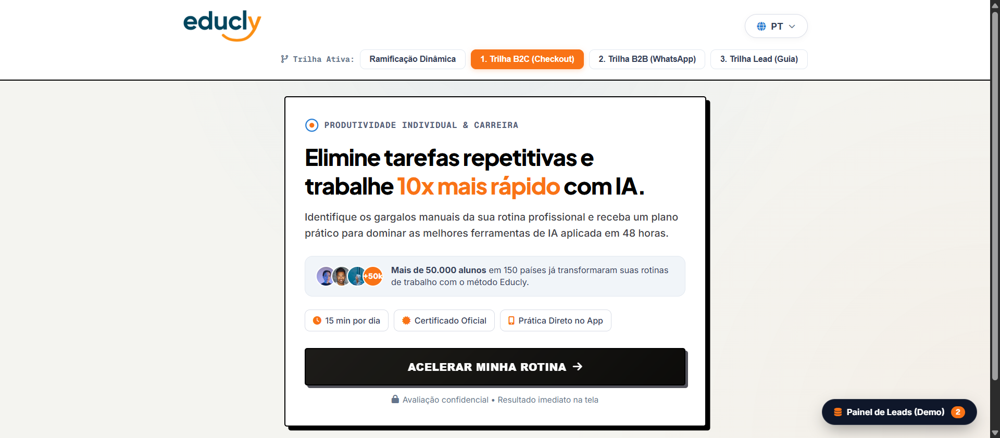
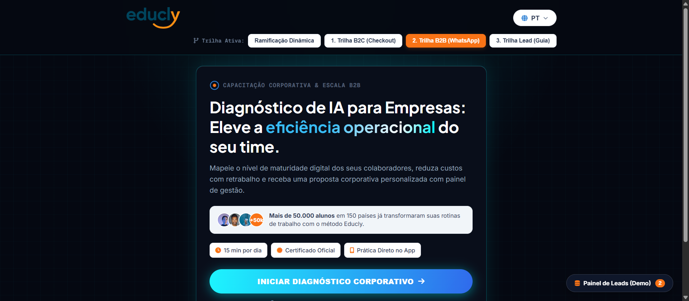

# Educly — Funil de Quiz Interativo com Ramificação Dinâmica, 4 Temas Modulares & i18n Nativo

[](#)
[-orange.svg)](#)
[](#)
[](#)
[](#)

> Plataforma interativa de qualificação, diagnóstico de IA e conversão desenhada para o ecossistema **Educly.app** (microlearning de Inteligência Artificial com desafio de 28 dias). Construída sob princípios de **engenharia de alta performance, zero dependências pesadas e modularidade de temas**.

---

## 🎨 Galeria dos 4 Temas Visuais & Ângulos de Copy

O projeto implementa uma arquitetura modular em CSS orientada por classes de escopo global no `document.body`, permitindo alternar instantaneamente entre 4 direções visuais e 4 propostas de copy sem recarregar o navegador:

| Tema / Modo | Arquitetura Visual | Proposta de Copy Inicial (Passo 0) | Screenshot |
| :--- | :--- | :--- | :--- |
| **0. Ramificação Dinâmica**<br>`theme-educly-1` | **Educly Autoral Oficial** (Laranja vibrante `#F97316`, card branco cirúrgico, sombras orgânicas e botão com animação *orange-sheen*). | *\"Descubra qual é o seu nível real de IA e quanto tempo você pode economizar.\"* |  |
| **1. Trilha B2C (Checkout)**<br>`theme-swiss-2` | **Swiss Minimalist & Bento Editorial** (Papel creme fosco `#F4F4F0`, linhas pretas de `2px`, sombras sólidas offset `6px 6px 0 #000` e alto contraste). | *\"Elimine tarefas repetitivas e trabalhe 10x mais rápido com IA.\"* |  |
| **2. Trilha B2B (WhatsApp)**<br>`theme-dark-3` | **Cyberpunk Neo-Terminal / Dark OLED** (Preto puro `#050811`, malha técnica, acentos ciano elétrico `#00F2FE` e feixe *Shimmer Beam*). | *\"Diagnóstico de IA para Empresas: Eleve a eficiência operacional do seu time.\"* |  |
| **3. Trilha Lead (Guia)**<br>`theme-aurora-4` | **Aurora Tech Glass** (Azul meia-noite `#090D18`, acrílico translúcido com `backdrop-filter: blur(18px)` e gradiente índigo). | *\"Domine a Inteligência Artificial do zero absoluto, sem complicação.\"* |  |

---

## 🚀 Proposta de Engenharia & Diferenciais de Arquitetura

1. **Performance Zero-Dependency (Vanilla JS Puro)**:
   - Carregamento inicial em menos de **200ms**.
   - Sem React/Vue/Next no bundle do usuário para tráfego pago, maximizando o *First Contentful Paint (FCP)* em dispositivos móveis 4G.
2. **Ramificação Condicional Real (Decision Tree Engine)**:
   - A partir da escolha de perfil na Pergunta 1, a árvore de decisão ramifica perguntas e entregáveis:
     - **B2C Individual** $\rightarrow$ Diagnóstico de tarefas $\rightarrow$ Oferta promocional com cronômetro de 15 minutos.
     - **B2B Corporativo** $\rightarrow$ Tamanho do time e dores operacionais $\rightarrow$ Conexão WhatsApp Executiva com dados pré-formatados.
     - **Lead Capture** $\rightarrow$ Nível de conforto e receios com IA $\rightarrow$ Formulário de cadastro para envio do Guia de 100 Prompts.
3. **Internacionalização Dinâmica (i18n)**:
   - 5 idiomas totalmente traduzidos (`PT`, `EN`, `ES`, `FR`, `DE`), abrangendo 100% das 12 perguntas, opções, botões, modais e telas de transição.
   - Alternância em tempo real sem perder o progresso ou estado da resposta ativa.
4. **Painel Embutido de Administração & Webhooks**:
   - Acesso via botão flutuante inferior para monitorar leads gerados localmente.
   - Inspector de payload JSON estruturado pronto para envio via Webhook (Supabase, Make, Zapier, HubSpot, CRM).

---

## 📂 Árvore Estruturada de Arquivos

```
educly-funil-quiz/
├── docs/
│   └── screenshots/                        # Evidências e capturas reais dos 4 temas
│       ├── 01-tema-educly-oficial.png      # Print do Tema 1 (Educly Autoral)
│       ├── 02-tema-swiss-bento.png         # Print do Tema 2 (Swiss Minimalist)
│       ├── 03-tema-dark-oled.png           # Print do Tema 3 (Dark OLED)
│       └── 04-tema-aurora-glass.png        # Print do Tema 4 (Aurora Tech Glass)
├── assets/                                 # Logotipos e elementos gráficos vetoriais
│   └── logoLanding-ginAp5wP.png            # Logotipo oficial em alta definição
├── app.js                                  # Motor de regras, árvore ramificada, temas e i18n
├── index.html                              # Aplicação principal de produção
├── style.css                               # Tokens, variáveis CSS e seletores modulares dos 4 temas
├── wireframe-comparativo.html              # Wireframe comparativo independente
├── .gitignore                              # Exclusão de arquivos de cache e ambiente
└── README.md                               # Documentação técnica e guia de engenharia
```

---

## 🛠️ Tecnologias e Padrões Aplicados

- **Core**: HTML5 Semântico, CSS3 Moderno (Custom Properties, Flexbox, Grid, Animações Shimmer Beam, Backdrop Filters), JavaScript ES6+ (Manipulação direta da DOM com event delegation).
- **Tipografia**: `Plus Jakarta Sans`, `Inter`, `Outfit`, `Geist Mono` / `JetBrains Mono`.
- **Ícones**: Font Awesome 6.5.1.
- **Persistência**: Web Storage API (`localStorage`) com fallback resiliente.
- **Governança de Código**: Branches temáticas, Pull Requests documentados com revisões técnicas e padrões semânticos de commit.

---

## 💻 Como Rodar o Projeto Localmente

### Opção 1: Navegador Direto
Dê um duplo clique no arquivo `index.html` para executar o quiz de produção imediatamente.

### Opção 2: Servidor de Desenvolvimento Local
```bash
# Executando via npx serve
npx serve -l 3005 .
```
Acesse no navegador:
- **Quiz de Produção**: `http://localhost:3005/index.html`
- **Wireframe Comparativo**: `http://localhost:3005/wireframe-comparativo.html`

---

## 📄 Autoria e Direitos

Projeto desenvolvido e arquitetado por **Thiago Nascimento Barbosa**.  
Identidade e marcas registradas pertencem ao **Educly.app**.
